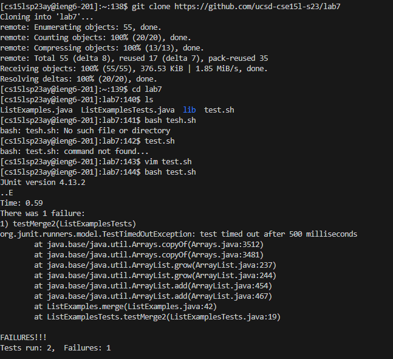
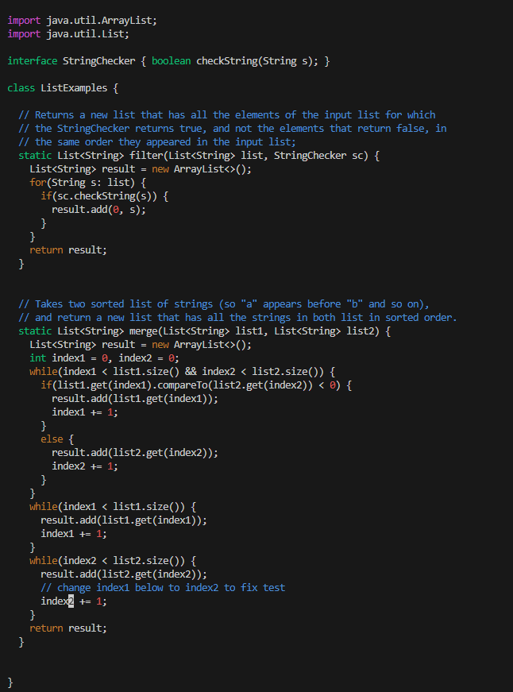
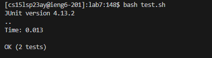

Lab Report 4
============

## Step 4:
Logging into ieng6: We log into our ieng6 as usual using ssh cs15lsp23__@ieng6.ucsd.edu
Where the underscores are to be replaced with your student specific account. 
*Note If you have not previously set up an ssh key to login, your password will be required to log in.

## Step 5 & 6:

We can clone the fork of the repository using the command `git clone https://github.com/ucsd-cse15l-s23/lab7`
and run the test.sh file using the command `bash test.sh`

*Tests failing:

## Step 7:

I then open the JavaExamples.java file with vim using the command `vim JavaExamples.java`

To the fix the bug, I first enter `/index1` to find the instances of the pattern 'index1' within the file.
I then press `<enter>`, this takes me to the first instance of 'index1', I use `n` nine times in a row
to take me to the instance of 'index1' that I plan to change. I use the right arrow key `->` 5 times to hover over the '1' in 'index1'
Using the `x` command, we can delete the character, then enter insert mode by pressing `i`. We enter '2' and exit insert mode by
pressing `esc`. Finally we exit and save the file by entering the command `:wq`

**Steps: **
`/index1`, `<enter>` , `n` `n` `n` `n` `n` `n` `n` `n` `n`, `right` `right` `right` `right` `right`, `x`, `i`, enter '2', `esc`, `:wq`

After doing so, the change we made to the file is then saved

## Step 8:

Similar to step 5, we run the test.sh file once again using the command `bash test.sh`

*Note: the tests should now pass. If not, then the ListExamples.java file was modified incorrectly!

## Step 9:

We can now commit and push the file we just changed using Vim! From the command line, we use the command `git add 'ListExamples.java' this
